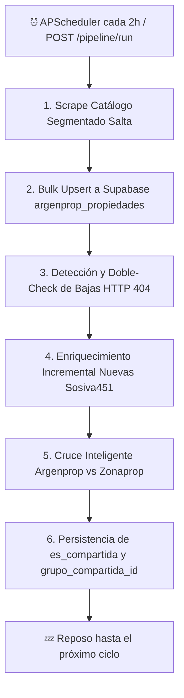

# 🏢 Argenprop Scraper & Real Estate Intelligence (Salta / NOA)

[](https://www.python.org/)
[](https://fastapi.tiangolo.com/)
[](https://supabase.com/)
[](https://www.docker.com/)
[](https://railway.app/)
[](https://streamlit.io/)

Motor de scraping e inteligencia de mercado inmobiliario para **Argenprop Salta**. Diseñado para operar en **Railway** con sincronización automática **cada 2 horas**, bypass inteligente de AWS WAF mediante **Chromium + Xvfb**, enriquecimiento de datos de contacto/GPS, y **Cruce Inteligente Multi-Portal contra Zonaprop** (detección de exclusivas y compartidas).

---

## 🌟 Características Principales

* ⏰ **Automatización Continua (Cada 2 horas)**: Controlado por `APScheduler` embebido en el ciclo de vida de FastAPI, ejecutando el pipeline de punta a punta sin intervención manual.
* 📦 **Segmentación Adaptativa sin Topes**: Supera la limitación nativa de 40 páginas de Argenprop segmentando por tipología (Casas, Deptos, Terrenos, etc.), operación y bandas de precio. Permite levantar catálogos de más de 4.000, 6.000 o 10.000 propiedades.
* 🛡️ **Bypass de AWS WAF**: Estrategia híbrida con `curl_cffi` (impersonación TLS Chrome 131) y fallback a `nodriver` (navegador real headless con display virtual Xvfb) para resolver desafíos WAF en la nube.
* 📍 **Enriquecimiento Automático de Fichas**: Obtención de geolocalización GPS exacta (lat/lon vía API Sosiva451), teléfonos/WhatsApp directos del anunciante y galería fotográfica en alta resolución.
* 🔗 **Cruce Inteligente contra Zonaprop (Cross-Portal Matcher)**: Algoritmo multivariable con tolerancia física, verificación de Manzana/Lote y scoring ponderado (+96% de precisión en carteras compartidas como RE/MAX Noa). Persiste en Supabase:
  * `es_compartida` (Booleano)
  * `es_exclusiva` (Booleano)
  * `grupo_compartida_id` (`zp_<zonaprop_id>`)
  * `anunciantes_grupo` (Lista de agencias que publican el mismo inmueble)
* 🎯 **Detección Quirúrgica de Bajas**: Detección de avisos despublicados con verificación HTTP previa (`verify_ficha_urls`), evitando falsos positivos por microcortes de red.
* ⚡ **Bulk Upsert de Alto Rendimiento**: Sincronización a Supabase en bloques de 100 registros mediante PostgREST (`resolution=merge-duplicates`), procesando más de 3.500 propiedades en segundos.

---

## 🏗️ Arquitectura del Pipeline (Cada 2 Horas)



---

## 🚀 Despliegue en Railway (Guía para el Líder Técnico)

El proyecto está 100% contenerizado y preparado para desplegarse como un servicio web en Railway conectándose al repositorio de GitHub.

### 1. Archivos de Despliegue
* **`Dockerfile`**: Basado en `python:3.12-slim`, preinstala Chromium, fuentes, Xvfb y arranca uvicorn dentro de una sesión virtual:
  ```dockerfile
  CMD ["sh", "-c", "xvfb-run -a --server-args='-screen 0 1920x1080x24 -ac' uvicorn src.api.app:app --host 0.0.0.0 --port ${PORT:-8000}"]
  ```
* **`railway.toml`**: Configura el build vía Dockerfile y política de reinicio `ON_FAILURE`.

### 2. Variables de Entorno Requeridas en Railway
En la sección **Variables** del servicio en Railway, cargar:

| Variable | Descripción | Ejemplo / Valor |
| :--- | :--- | :--- |
| `NEXT_PUBLIC_SUPABASE_URL` | URL del proyecto Supabase oficial | `https://gnqewqtpvygnkxryyaij.supabase.co` |
| `SUPABASE_SERVICE_ROLE_KEY` | Clave de servicio para escritura y cruce | `eyJhbGciOiJIUzI1...` |
| `API_KEY` | Clave para proteger endpoints REST | `kX9mP2vL_argenprop_2026` |
| `SYNC_INTERVAL_HOURS` | Intervalo de ejecución automática | `2` |
| `RUN_ON_STARTUP` | Disparar sync 15s tras iniciar el contenedor | `true` |
| `CATALOG_LIMIT` | Límite máximo de catálogo | `10000` |
| `ENRICH_LIMIT` | Límite de fichas nuevas a enriquecer por ciclo | `300` |

---

## 📡 API REST (Endpoints Disponibles)

Todos los endpoints que modifican datos o consultan métricas requieren el header `x-api-key`.

| Método | Endpoint | Descripción | Autenticado |
| :---: | :--- | :--- | :---: |
| `GET` | `/health` | Chequeo de salud, estado del pipeline y `next_scheduled_run` | No |
| `GET` | `/` | Lista de servicios, endpoints y resumen de última ejecución | Sí |
| `POST` | `/pipeline/run` | Dispara el pipeline completo (Scrape + Bajas + Enrich + Match) | Sí |
| `POST` | `/verify/fichas` | Verificador puntual de URLs de avisos (igual a Zonaprop) | Sí |
| `POST` | `/match/run` | Re-calcula y persiste el cruce con Zonaprop en Supabase | Sí |
| `GET` | `/match/stats` | Resumen de métricas de mercado compartido y exclusivo | Sí |
| `POST` | `/scrape/supabase` | Scrape de catálogo hacia Supabase | Sí |
| `POST` | `/enrich/supabase` | Enriquecimiento de fichas pendientes en Supabase | Sí |

### Ejemplo: Verificación de Fichas (`POST /verify/fichas`)
```json
// Request Body
{
  "items": [
    {"zpId": "19720535", "url": "https://www.argenprop.com/casa-en-venta-en-la-caldera--19720535"},
    {"zpId": "99999999", "url": "https://www.argenprop.com/aviso-inexistente--99999999"}
  ]
}

// Response
{
  "ok": true,
  "results": [
    {"zpId": "19720535", "argenprop_id": "19720535", "url": "...", "alive": true, "status": 200},
    {"zpId": "99999999", "argenprop_id": "99999999", "url": "...", "alive": false, "status": 404}
  ]
}
```

---

## 💻 Instalación y Uso Local

### 1. Clonar e Instalar
```bash
# Crear entorno virtual
python3.12 -m venv .venv
source .venv/bin/activate

# Instalar dependencias del proyecto
pip install -e .
```

### 2. Configurar Variables Locales
```bash
cp .env.example .env
# Completar con las credenciales de Supabase
```

### 3. Comandos CLI Principales
```bash
# Ejecutar el pipeline de producción completo (Scrape -> DB -> Bajas -> Enrich -> Match):
python -m src.cli pipeline

# Persistir únicamente el cruce contra Zonaprop en Supabase:
python -m src.cli persist-match

# Iniciar el scheduler en consola (cada 2 horas):
python -m src.cli schedule

# Ejecutar el visor interactivo de Streamlit:
streamlit run app.py
```

---

## 📊 Estructura de Datos en Supabase (`argenprop_propiedades`)

```
argenprop_propiedades
├── id (BIGINT PK)                   ├── latitud / longitud (FLOAT)
├── argenprop_id (TEXT UNIQUE)       ├── coordenadas_origen (sosiva_api / scraper)
├── titulo / descripcion             ├── anunciante_nombre / anunciante_logo
├── tipo_propiedad                   ├── anunciante_telefono / anunciante_whatsapp
├── tipo_operacion (venta/alquiler)  ├── visualizaciones / publicado_hace
├── precio / moneda / expensas       ├── nivel_destacado / es_super_destacado
├── superficie_total / cubierta      ├── imagen_principal / imagenes (TEXT[])
├── ambientes / dormitorios          ├── raw_data (JSONB)
├── banos / cocheras                 ├── activa (BOOLEAN) / fecha_baja / motivo_baja
├── ubicacion / barrio / localidad   ├── primera_vez_visto / ultima_actualizacion
│
├── 🔗 CAMPOS DEL CRUCE CON ZONAPROP:
├── es_compartida (BOOLEAN)          → True si está publicada en ambos portales
├── es_exclusiva (BOOLEAN)           → True si sólo existe en Argenprop
├── grupo_compartida_id (TEXT)       → Identificador de matching ("zp_<zonaprop_id>")
├── anunciantes_grupo (TEXT[])       → Lista de agencias que publican el inmueble
└── cantidad_inmobiliarias (INT)     → Número de agencias distintas detectadas
```

---

## 🤝 Mantenimiento y Operaciones
Desarrollado para la inteligencia de mercado y captación de **RE/MAX NOA**.  
Cualquier ajuste de variables o periodicidad se configura directamente desde Railway a través de `SYNC_INTERVAL_HOURS`.
